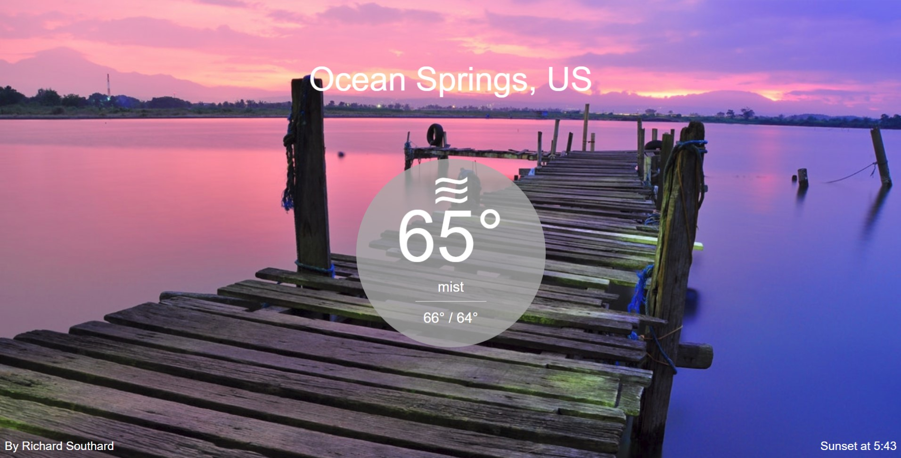

# Local Weather
Local Weather app for FreeCodeCamp.org.

I used the Open Weather Map API and bootstrap CSS CDN to create the project.    A live demo can be found on my portfolio site-[Richard Southard](https://www.richardsouthard.com/projects/Weather/index.html)

This is the final result of the project.

